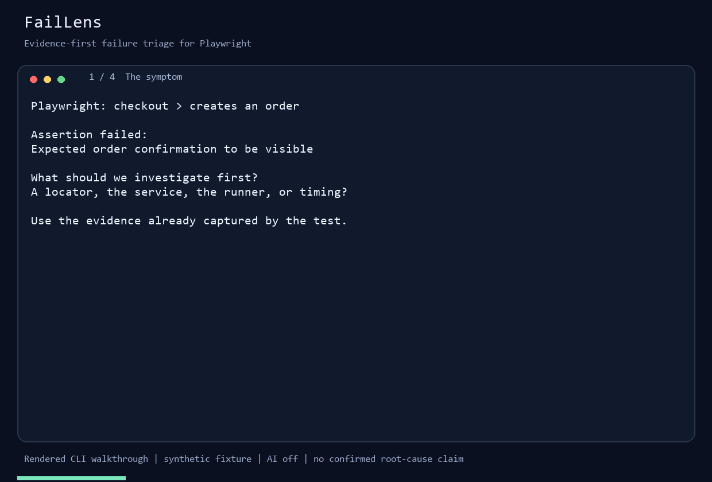
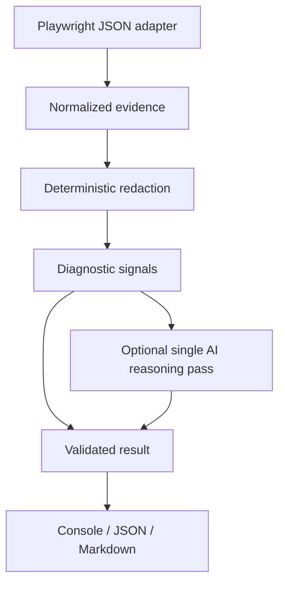

# FailLens

**Evidence-first AI triage for Playwright failures.**

Playwright tells you a test failed. FailLens turns the available evidence into a hypothesis you can investigate, with references you can inspect.

```text
Classification: PRODUCT_BUG
Diagnostic confidence: 0.65 (uncalibrated)

Observations
- [network-1] POST https://demo.test/api/orders → 500

Hypothesis
The evidence suggests product bug behavior.
This is a diagnostic hypothesis, not a verified root cause.

Suggested next investigation
- Inspect service logs for the observed failing request.
```

[Türkçe](README.tr.md) · [Architecture](docs/architecture.md) · [Security](docs/security.md)

## Why FailLens?

A failure message rarely explains whether to investigate a service, a locator, credentials, or timing. FailLens gathers structured evidence, removes common secrets, detects conservative signals, and points to the next investigation. It works without an API key. When evidence is missing or conflicting, it says `unknown`.

## Demo

Run `npm run demo` for instant, deterministic output from a synthetic fixture. No browser download or API key is needed.



The animation is rendered from actual CLI output with a synthetic fixture; it is not a live terminal recording or an AI run. [Recording and regeneration details](docs/demo-script.md).

The real browser demo has five deliberate scenarios: order API 500, stale button locator, retry recovery, refused dependency connection, and assertion-only unknown. It also collects screenshots and traces locally.

```sh
npm exec playwright install chromium
npm run demo:playwright
```

The demo harness verifies each category and writes `artifacts/demo-triage.md`. The underlying tests intentionally fail; only this demonstration harness treats those expected failures as success.

## Quick Start

In a downloaded or cloned checkout, with Node.js 20.19 or newer:

```sh
git clone https://github.com/eyupcanbilgin/faillens.git
cd faillens
npm ci
npm run demo
```

## Installation

Version 0.1.0 is prepared for publication; **the npm package has not been published**. The registry lookup on 2026-09-16 returned no package named `faillens`; this does not reserve the name or guarantee a future publish. The GitHub repository may remain private during release verification. Use the local build now:

```sh
npm run build
node dist/cli.js analyze fixtures/product-bug/backend-500/input.json
npm pack
```

To try it in another project, install the generated tarball using its actual path:

```sh
npm install --save-dev ../faillens/faillens-0.1.0.tgz
npx faillens --help
```

## Example: collect richer evidence

Enable Playwright's JSON reporter in your config:

```ts
reporter: [['list'], ['json', { outputFile: 'artifacts/results.json' }]],
```

Plain JSON supports errors, user-defined `test.step` steps, and retries. **It does not automatically record browser console errors or network responses.** Install the optional collector around the interaction under investigation:

```ts
import { test, expect } from "@playwright/test";
import { collectEvidence } from "faillens/playwright";

test("creates order", async ({ page }, testInfo) => {
  await page.goto("/checkout");
  const capture = collectEvidence(page);
  try {
    await test.step("Place order", () =>
      page.getByRole("button", { name: "Place order" }).click());
    await expect(page.getByRole("status")).toHaveText("Order confirmed");
  } finally {
    await capture.finish(testInfo);
  }
});
```

The collector stores a redacted, versioned inline attachment in JSON. It collects this page's events during this interval only. It does not collect bodies or headers. No attachment path is opened by analysis. See [capture details](docs/capture.md).

## CLI

```sh
node dist/cli.js --help
node dist/cli.js analyze artifacts/results.json --ai off
node dist/cli.js analyze artifacts/results.json --format json
node dist/cli.js analyze artifacts/results.json --format markdown --output artifacts/triage.md
node dist/cli.js analyze artifacts/results.json --max-failures 10
node dist/cli.js analyze artifacts/results.json --ai openai --model gpt-4.1-mini
```

Only failed attempts are analyzed, including tests that later pass on retry. Expected failures and skips are excluded. For multiple failed attempts, the last failed attempt is used. The default is 20 failures, configurable up to 100. Reaching the cap produces a warning on stderr. All output is redacted, even with AI disabled.

Exit `0` means analysis completed, including an empty run or a handled AI fallback. Exit `1` means invalid input/configuration, an execution failure, or an output-write failure. Invalid command usage also returns nonzero. Keep Playwright's exit status independently in CI.

## How It Works



## Architecture

Framework-specific parsing stays in `adapters/playwright`. Core code owns evidence, deterministic signals, result validation, and provider orchestration. Vendor code lives in `providers`. Redaction precedes provider calls; renderers consume validated results. The collector has a type-only Playwright dependency, so the analysis CLI does not install browsers. [Details and decisions](docs/architecture.md).

## Failure Categories

| Category        | Current signal                                                                | Interpretation                                                            |
| --------------- | ----------------------------------------------------------------------------- | ------------------------------------------------------------------------- |
| `product_bug`   | Observed HTTP 5xx                                                             | Investigate the service; upstream or environmental causes remain possible |
| `test_bug`      | Locator timeout, a prior passed step, and complete capture with zero requests | Inspect locator and UI intent; missing UI may still be a product issue    |
| `environment`   | 401/403 or explicit connection/browser infrastructure symptom                 | Inspect dependencies, credentials, or runner                              |
| `flaky_suspect` | Failed attempt followed by a passing retry                                    | Recovery was observed; historical flakiness is unproven                   |
| `unknown`       | No discriminating signal, or conflicting categories                           | More evidence needed                                                      |

Retry recovery takes precedence because it is a directly observed property of the run. Other competing categories produce unknown. Console errors and stale assertions alone are not sufficient to classify safely.

## Deterministic Mode

Deterministic mode is the default and the product foundation. Fixed heuristic confidence values express diagnostic strength, **not calibrated probabilities**. Each classification cites evidence IDs. Missing capture is explicitly reported; absence of captured data never proves absence of an event.

## AI Mode

Set `OPENAI_API_KEY` in your shell or CI secret environment (never commit it), then:

```sh
npm run demo:ai
node dist/cli.js analyze artifacts/results.json --ai openai
```

PowerShell setup uses `$env:OPENAI_API_KEY` and POSIX shells use `export OPENAI_API_KEY`; use your secret manager to supply the value. FailLens does not load `.env` files automatically.

OpenAI receives only redacted evidence for the current failure, through the Responses API. The default model is `gpt-4.1-mini`, overridable with `--model`. There is one call per failure, a 20-second request timeout, no SDK retries, a 64 KB payload ceiling, and a 1,600-token output cap. `store: false` is requested; this is not a promise about all provider retention policies.

The model can elaborate the existing hypothesis or abstain. It cannot promote unknown or change to an unsupported category. Schema, evidence IDs, and category support are checked locally. Provider errors and invalid answers fall back to the deterministic result with a visible warning. Fake providers exercise this path in CI. Live smoke testing is explicit and may incur charges:

```sh
npm run test:ai:live
```

## Security

The AI has no executable tools, shell, browser, file access, or write capability. Artifact text is untrusted data. The repository includes a prompt-injection fixture and tests for invented references and unsupported classifications. No prompt can grant capabilities that are absent. Prompt instructions and category checks cannot guarantee every generated sentence is correct; humans must assess the hypothesis. [Threat model](docs/security.md).

## Privacy

FailLens redacts common authentication headers, cookies, token/password fields, JWT-like strings, key patterns, email addresses, URL credentials and query values. It drops attachment metadata before rendering or provider calls. Raw traces and screenshots are never uploaded. Redaction is a defense in depth, **not a complete PII or secret detector**: custom encodings, unknown formats, and sensitive route segments may remain. Review artifacts before opting into external AI. [Policy and limits](docs/security.md).

## Evaluation

```sh
npm test
npm run test:coverage
npm run eval
```

The evaluation writes `eval-results.json` and reports category agreement, schema/reference validity, required unknown behavior, and security fixture results. The 14 synthetic fixtures are regression examples, not an independent benchmark or real-world accuracy estimate. Expected normalized evidence and signals are checked into each fixture. No exact AI prose is asserted.

## OpenTelemetry

Telemetry is disabled by default. `--telemetry` enables OTLP/HTTP using `OTEL_EXPORTER_OTLP_ENDPOINT` or `OTEL_EXPORTER_OTLP_TRACES_ENDPOINT` and standard exporter configuration. Instrumented spans cover analysis, redaction, signals, optional AI, and result validation. No evidence text, test title, prompt, model response, or exception message is added to spans. No auto-instrumentation or machine-resource detection is enabled. No collector is required for normal use. [Configuration](docs/observability.md).

## GitHub Actions

The repository CI runs on Linux and Windows with no model credentials: checks, evaluation, package smoke, and the real Playwright demo. Consumer integration uses a normal failing Playwright step, `if: always()` for analysis, and read-only artifact uploads. [Copyable integration](docs/github-actions.md).

## Limitations

- Only the JSON reporter is supported; report shape is validated conservatively, tested with the locked Playwright version.
- No raw trace parsing, screenshot reasoning, backend logs, historical flake statistics, or full retry diff.
- Generic assertion failures often produce unknown. A 5xx is a symptom, not proof of application ownership.
- Capture covers one page during the chosen interval. It does not cover worker or popup requests outside that page.
- Limits may omit evidence; truncated/incomplete capture prevents zero-request inference. Inputs over 10 MiB are rejected.
- AI output is schema-constrained but its prose can still be wrong. Live provider behavior must be smoke-tested by the maintainer with an explicit key.
- No persistent cache. A SHA-256 fingerprint of redacted evidence is provided for comparison, not historical analysis.

## What FailLens Does NOT Do

FailLens does not replace Playwright, claim confirmed root causes, edit tests or applications, run shell commands, open PRs, upload screenshots, or require AI for evidence extraction. Investigation remains separate from remediation so a mistaken hypothesis cannot silently change your system.

## Roadmap

- **v0.1:** JSON evidence, conservative signals, optional bounded AI, privacy, evaluation, CI, telemetry.
- **v0.2:** read-only MCP interface, richer trace extraction, configurable redaction, other model providers.
- **v0.3:** historical flake analysis, fingerprint comparisons, clustering.
- **Future:** Cypress, Selenium/JUnit, pytest adapters through the same evidence boundary.

MCP is deliberately deferred. Proposed read-only tools are documented in [the architecture](docs/architecture.md); fixing and shell tools are excluded.

## Contributing

Start with a synthetic failure fixture and an invariant. See [CONTRIBUTING.md](CONTRIBUTING.md), [CODE_OF_CONDUCT.md](CODE_OF_CONDUCT.md), and [SECURITY.md](SECURITY.md).

## License

[MIT](LICENSE), chosen to make adoption and embedding straightforward with minimal redistribution obligations.
