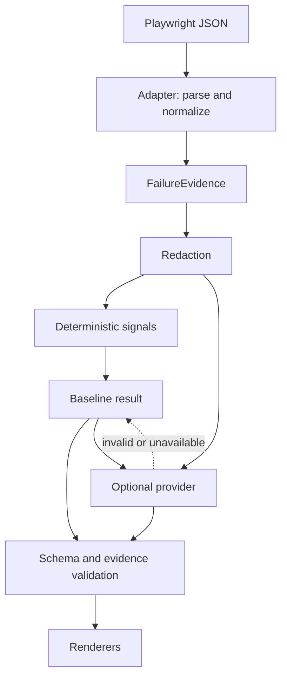

# Architecture

FailLens is a small library and CLI. It has no service process, persistent database, or agent orchestration framework.

## Boundaries

- `adapters/playwright/parser.ts` is the only report parser. It consumes unknown JSON, validates the supported report skeleton, normalizes failed attempts, and assigns deterministic IDs scoped to one failure. It never opens paths from the report.
- `collector.ts` is an optional test-side helper. Public Playwright page events and inline `testInfo.attachments` provide a versioned capture. JSON reporting does not supply these events automatically.
- `core/evidence.ts` is framework-independent. Evidence IDs refer to observed errors, steps, network failures, console events, retry state, or capture state.
- `privacy` explicitly traverses normalized fields. Unknown raw report metadata is never forwarded. Provider input and rendered output use redacted evidence.
- `core/signals.ts` produces typed observations and conservative aggregation. Competing categories become unknown; observed retry recovery takes precedence.
- `core/provider.ts` defines the provider-independent contract. Core never imports OpenAI. Providers get clones of the redacted failure and baseline so mutation cannot alter the fallback.
- `providers/openai.ts` uses one Responses API structured-output request. The model has zero tools. A small schema-validated view allowlist documents read-only access for future providers without implementing a tool loop.
- `core/analyzer.ts` validates the result and every evidence reference. AI can retain the deterministic category or abstain, but cannot exceed this evidence envelope. A failed provider restores the entire baseline and adds a warning.
- `renderers.ts` supports text, Markdown and JSON. Markdown escapes artifact-controlled markup and links. Console controls are stripped during redaction.

The library's parser returns normalized but not yet redacted evidence. Call `analyze` for the protected pipeline; never forward the raw parser result to another service yourself. Model prose is a hypothesis even after schema and ID validation; these checks do not establish semantic truth.

## Resource budgets

Reports: 10 MiB. Failures: 20 default / 100 maximum. Suite depth: 30. Suite visits: 50,000. Steps: 80, nesting: 20. Strings: 4,000 characters. Capture: 40 console errors and 40 network failures. Attachment candidates: first 20. Inline capture: 128,000 base64 characters. Provider input: 64,000 bytes, one call per failure, 20 seconds, no retries, 1,600 output tokens.

No absence claim is made without a complete capture. Large provider payloads cause an explicit deterministic fallback rather than unbounded sending. The current evidence fingerprint hashes the redacted normalized representation; it is version-local and does not promise stability across parser changes.

## Extensibility

A future test framework adapter produces `FailureEvidence`; the signal engine, privacy layer, providers, and renderers remain shared. Do not add adapters until representative fixtures exist. Trace extraction needs its own versioned boundary and stable format support; v0.1 has no fake trace parser.

## Deferred MCP design

v0.2 may expose `faillens_list_failures`, `faillens_get_failure`, `faillens_get_evidence`, `faillens_get_diagnostic_signals`, `faillens_explain_failure`, and `faillens_compare_attempts`. Each request must use an already-loaded report and failure ID, with the same limits and redaction. Arbitrary path arguments, shell, fixing, and commit tools are excluded. No MCP implementation is included in v0.1.

## API verification

Implementation was checked against the installed package declarations and a real Playwright JSON run. Public references:

- [Playwright reporters](https://playwright.dev/docs/test-reporters) and [TestInfo](https://playwright.dev/docs/api/class-testinfo).
- [OpenAI Node structured outputs](https://github.com/openai/openai-node/blob/main/docs/structured-outputs.md).
- [OpenTelemetry JS instrumentation](https://opentelemetry.io/docs/languages/js/instrumentation/).

The lockfile records exact versions. CI catches changes through typechecking, actual reporter integration, and package smoke testing; no undocumented runtime imports are used.
